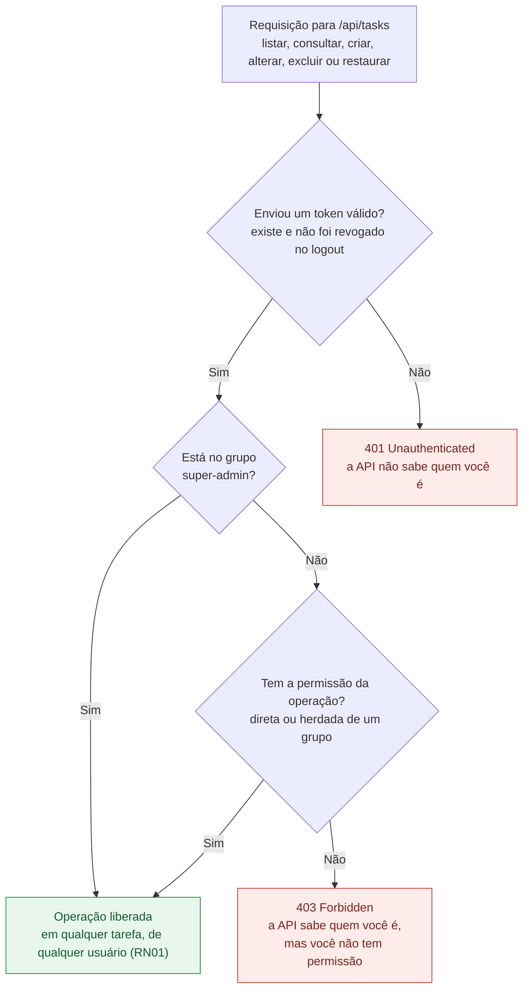
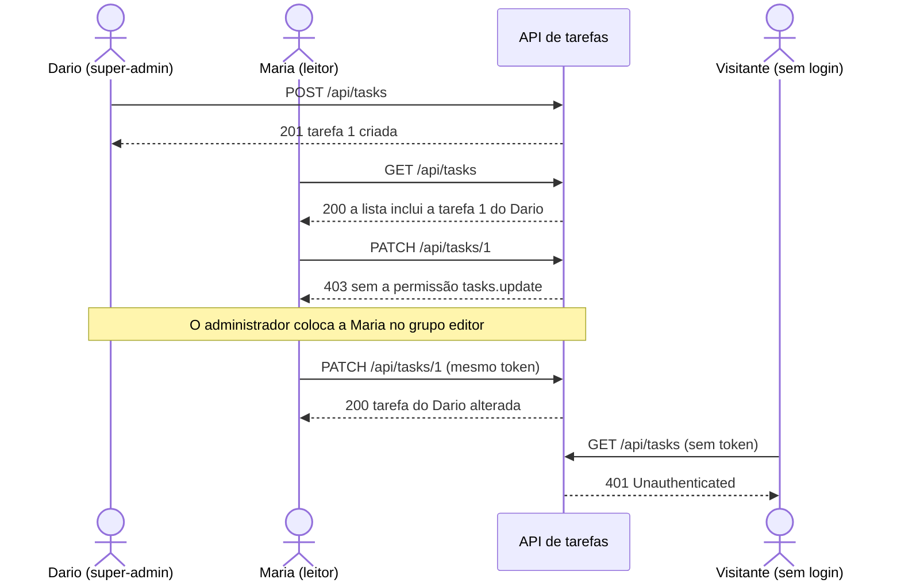

# Regras de negócio

| Código | Regra |
|---|---|
| [RN01](#rn01--tarefas-compartilhadas-sem-dono) | Tarefas compartilhadas, sem dono |
| [RN02](#rn02--login-obrigatório-e-permissão-por-operação) | Login obrigatório e permissão por operação |
| [RN03](#rn03--só-o-administrador-cria-usuários) | Só o administrador cria usuários |

---

## RN01 — Tarefas compartilhadas, sem dono

> **As tarefas não têm dono. Quem tem a permissão de uma operação pode realizá-la em qualquer tarefa, inclusive nas criadas por outros usuários.**

- A API não registra nem verifica quem criou cada tarefa.
- Uma usuária com permissão de alterar tarefas altera as tarefas de todos, não só as que ela criou.

---

## RN02 — Login obrigatório e permissão por operação

> **Para usar as tarefas é obrigatório estar logado e ter a permissão da operação. O super-admin pode tudo.**

- Sem login (sem token, com token inválido ou revogado no logout), **nenhuma** operação com tarefas é permitida: `401`.
- Logado, cada operação exige uma **permissão**. Sem ela: `403`.
- As permissões são agrupadas em **grupos (papéis)**. Um usuário pode estar em vários grupos e também receber permissões **diretamente**.
- O grupo `super-admin` pode tudo, sem precisar receber permissões.
- Qualquer usuário pode fazer login e consultar os próprios dados (`/api/auth/me`), mesmo sem nenhuma permissão.

### Permissões

| Permissão | Libera |
|---|---|
| `tasks.view` | Listar, consultar e ver a lixeira |
| `tasks.create` | Criar tarefas |
| `tasks.update` | Alterar título, descrição e status |
| `tasks.delete` | Excluir (enviar para a lixeira) |
| `tasks.restore` | Restaurar da lixeira |

### Grupos (papéis) e usuários

| Grupo | Permissões | Usuários de desenvolvimento |
|---|---|---|
| `super-admin` | Todas | Dario |
| `editor` | Todas as permissões de tarefas | — |
| `leitor` | `tasks.view` | Maria, Ana |

### Como a API decide

### Exemplo

O Dario (`super-admin`) cria uma tarefa. A Maria (`leitor`) vê essa tarefa, mas não consegue alterá-la, até o administrador colocá-la no grupo `editor`. Um visitante sem login é bloqueado.

### Quem pode fazer o quê

| Operação | Permissão | Sem login | `leitor` | `editor` | `super-admin` |
|---|---|---|---|---|---|
| Fazer login e ver os próprios dados | — | ✅ login | ✅ | ✅ | ✅ |
| Listar, consultar e ver a lixeira | `tasks.view` | ❌ `401` | ✅ | ✅ | ✅ |
| Criar | `tasks.create` | ❌ `401` | ❌ `403` | ✅ | ✅ |
| Alterar | `tasks.update` | ❌ `401` | ❌ `403` | ✅ | ✅ |
| Excluir | `tasks.delete` | ❌ `401` | ❌ `403` | ✅ | ✅ |
| Restaurar | `tasks.restore` | ❌ `401` | ❌ `403` | ✅ | ✅ |

---

## RN03 — Só o administrador cria usuários

> **Não existe cadastro público. Os usuários são criados pelo administrador, que também define seus grupos e permissões.**

- Por enquanto, os usuários são criados pelo seeder (ambiente de desenvolvimento) ou pelo Tinker. Os endpoints de administração ficam para uma próxima etapa.
- A antiga rota `POST /api/auth/register` não existe mais (`404`).

---

## Onde as regras estão implementadas

| Regra | Implementação |
|---|---|
| RN01: tarefas sem dono | A tabela `tasks` não tem coluna de dono, e o `TaskController` consulta as tarefas sem filtrar por usuário |
| RN02: login obrigatório | Middleware `auth:sanctum` nas rotas de tarefas ([`routes/api.php`](../routes/api.php)) |
| RN02: permissão por operação | `TaskController::middleware()` exige `can:tasks.*` em cada ação; grupos e permissões criados pelo `RolePermissionSeeder` |
| RN02: super-admin | `Gate::before` no `AppServiceProvider` |
| RN03: sem cadastro público | Não há rota de cadastro; usuários criados pelo `UserSeeder` ou pelo Tinker |
| Testes | `TaskApiTest` (401 em cada rota), `TaskAuthorizationTest` (403, leitor, permissão direta e super-admin), `AuthApiTest::test_public_registration_is_disabled` e `DatabaseSeederTest` |
