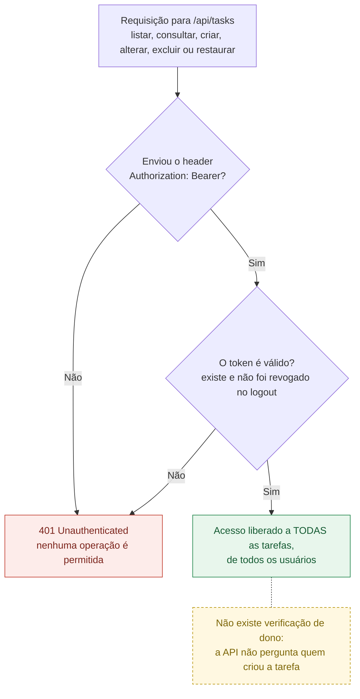
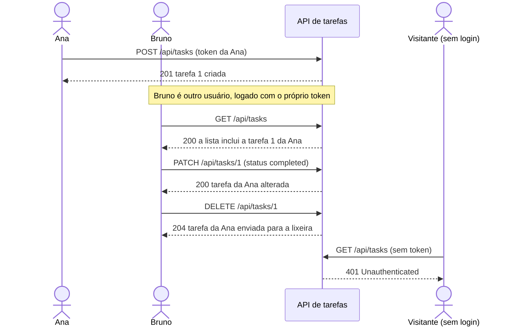

# Regras de negócio

## RN01 — Tarefas compartilhadas entre usuários logados

> **Para usar as tarefas é obrigatório estar logado. Depois de logado, o usuário vê e altera todas as tarefas, de todos os usuários.**

- Sem login (sem token, com token inválido ou com token revogado no logout), **nenhuma** operação com tarefas é permitida.
- Com login, **qualquer** usuário pode listar, consultar, criar, alterar, excluir e restaurar **qualquer** tarefa, inclusive as criadas por outras pessoas.
- As tarefas **não têm dono**: a API não registra nem verifica quem criou cada tarefa.

### Como a API decide

### Exemplo com dois usuários

A Ana cria uma tarefa. O Bruno, logado com a própria conta, enxerga e altera essa tarefa normalmente. Um visitante sem login é bloqueado.

### Quem pode fazer o quê

| Operação | Sem login | Logado (qualquer usuário) |
|---|---|---|
| Listar tarefas (inclusive a lixeira) | ❌ `401` | ✅ todas as tarefas |
| Consultar uma tarefa | ❌ `401` | ✅ qualquer tarefa |
| Criar tarefa | ❌ `401` | ✅ |
| Alterar título, descrição ou status | ❌ `401` | ✅ qualquer tarefa |
| Excluir (enviar para a lixeira) | ❌ `401` | ✅ qualquer tarefa |
| Restaurar da lixeira | ❌ `401` | ✅ qualquer tarefa |

### Onde a regra está implementada

| Parte da regra | Implementação |
|---|---|
| Exigir login | Middleware `auth:sanctum` em todas as rotas de tarefas ([`routes/api.php`](../routes/api.php)) |
| Acesso a todas as tarefas | O `TaskController` consulta as tarefas sem filtrar por usuário, e a tabela `tasks` não tem coluna de dono |
| Testes | `TaskApiTest::test_routes_require_authentication` verifica o `401` em cada uma das 6 rotas de tarefas |
